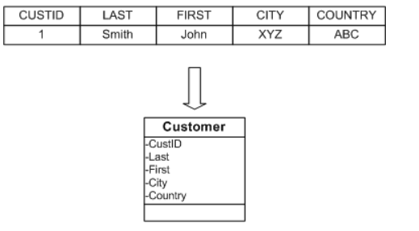
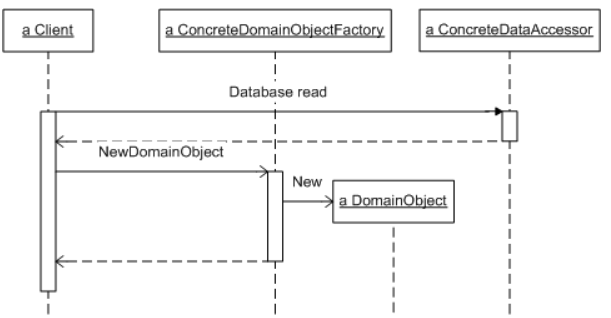

# Domain Object Factory

## Цель 
Заполняет объекты домена на основе результатов запроса.

## Сценарий
В шаблоне «Фабрика выбора» мы упомянули, что основной функцией любого сопоставления
объектов предметной области является определение набора реляционных данных,
с которыми нужно работать . Приложения указывают этот набор с помощью объектов 
идентификации, а реляционной концепцией, аналогичной объекту идентификации, 
является предложение WHERE в операторах SQL. Еще одна основная функция любого 
сопоставления объектов предметной области — заполнение объектов предметной области
на основе результатов запроса .  Каждый ряд результата запроса содержит данные,
необходимые для создания и инициализации нового объекта предметной области.
В некоторых случаях это так же просто, как копирование данных непосредственно 
из набора результатов в новый объект предметной области. Однако также часто 
включают дополнительные сопоставления и переводы.

Рассмотрим таблицу базы данных, которая содержит имена и адреса клиентов. 
Распространение физических данных этой таблицы по всему приложению отрицательно 
сказывается на удобстве сопровождения приложения и серьезно ограничивает будущие 
изменения в таблице и поддерживающей ее базе данных. Определение объекта домена 
Customer, с которым может взаимодействовать приложение, помогает инкапсулировать
сведения о физической таблице в один объект. Отображение объекта домена отвечает
за преобразование строки из заданной таблицы в объект, который предоставляет 
столбцы строки как свойства. Эта ситуация показана ниже:

Таким образом, шаблон фабрики доменных объектов описывает стратегию инкапсуляции 
деталей этого типа перевода. Поскольку эти детали могут различаться в разных 
таблицах и объектах предметной области, вы можете определить фабричные объекты
для каждого варианта перевода. Вход в фабрику объектов домена — это строка данных,
а выход — соответствующий объект домена.

Фабрика объектов домена определяет одну операцию для создания и заполнения
новых объектов домена на основе отдельных строк данных. Вы можете настроить 
формат входных данных на основе физического представления данных, наиболее 
удобного для вашего кода промежуточного слоя. Например, в ADO.NET NewDomaonObject ,
скорее всего, примет объект DataRow в качестве входного параметра.
Еще лучше, если вы используете паттерн Layers и сопоставление объектов домена
находится поверх Data Accessor , вы можете определить NewDomainObject для принятия
более абстрактного представления данных, независимого от какой-либо платформы базы
данных.

ConcreteDomainObjectFactory реализует IDomainObjectFactory для определенного 
объекта базы данных или типа объекта домена. Для общего сопоставления объектов 
предметной области, вероятно, потребуется несколько реализаций 
ConcreteDomainObjectFactory с настроенными деталями сопоставления, 
инкапсулированными в каждой из них. Клиентский код и общий код инфраструктуры 
сопоставления объектов домена относятся только к интерфейсу IDomainObjectFactory, 
что позволяет отделить его от каких-либо конкретных деталей сопоставления.

На следующем рисунке показана диаграмма последовательности, когда клиент запрашивает
новый объект домена:

Клиент выполняет чтение базы данных и передает результаты соответствующему
методу ConcreteDomainObjectFactory.NewDomainObject. NewDomainObject возвращает
объект домена, который клиент может использовать для логики приложения.