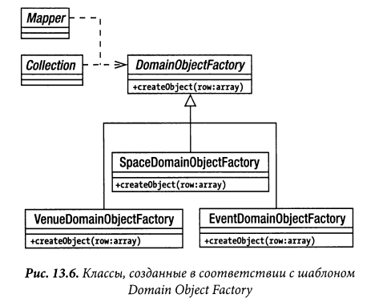
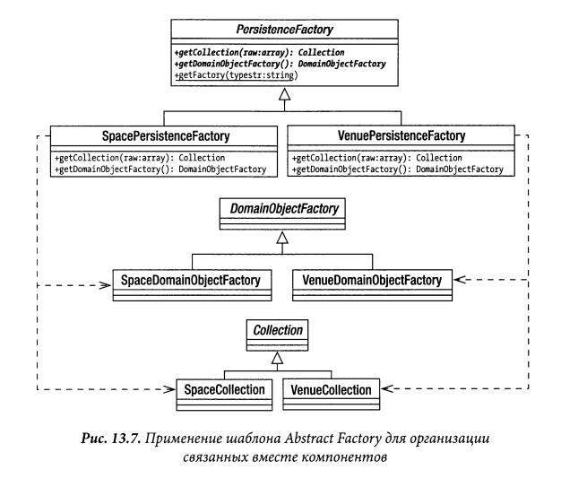

# Domain Object Factory

Шаблон Data Mapper изящен, но у него есть некоторые недостатки.
В частности, класс Mapper берет на себя слишком много обязанностей.
В нем составляются операторы SQL, массивы преобразуются в объекты,
а последние — обратно в массивы, готовые для добавления в базу данных.
Такая разносторонность делает класс Mapper удобным и эффективным, но
в то же время она способна в какой-то степени уменьшить гибкость. Это
особенно справедливо в том случае, если преобразователь данных типа
Mapper должен обрабатывать самые разные виды запросов или если другие классы должны совместно использовать общие функциональные средства вместе с классом Mapper.
В оставшейся части главы будет показано, как разделить шаблон Data
Mapper на ряд более специализированных шаблонов. При объединении
этих мелкоструктурных шаблонов воспроизводятся все обязанности,
которые выполнялись в шаблоне Data Mapper, причем некоторые из них
(если не все!) можно использовать вместе с этим шаблоном. Эти шаблоны хорошо описаны Клифтоном Ноком (Clifton Nok) в книге Data Access
Patterns (Addison Wesley, 2003), из которой взяты их названия там,
где имеются разночтения. Итак, начнем с основной задачи — формирования 
объектов предметной области



У классов, созданных в соответствии с шаблоном Domain Object Factory,
имеется лишь одна основная обязанность, поэтому они, как правило, очень
просты, как показано в следующем примере абстрактного класса:

```php
abstract class DomainObjectFactory
{
    abstract public function createObject(array $row): DomainObject;
}
```
А вот как выглядит конкретная реализация этого абстрактного класса
```php
class VenueObjectFactory extends DomainObjectFactory
{
    public function createObject(array $row): Venue
    {
        $obj = new Venue((int)$row['id'], $row['name']);
        return $obj;
    }
}
```

Конечно, чтобы не допустить дублирования кода и предотвратить излишние 
обращения к базе данных, необходимо кешировать объекты, как
это было сделано с классом Mapper. В приведенный выше класс можно также
переместить методы addToMap() и getFromMap() ,
или можно установить взаимосвязь класса ObjectWatcher с методами createObject() 
по типу наблюдателя. Подробности оставляются вам в качестве упражнения,
но не допускайте создания клонов объектов предметной области, чтобы
система не стала неуправляемой!

## Следствие
Исходя из типа используемого объекта предметной области нам потребуются разные конкретные
реализации, например VenueCollection и VenueDomainObjectFactory
или SpaceCollection и SpaceDomainObjectFactory. И это затруднение, безусловно, приводит нас непосредственно к шаблону Abstract Factory.
На рис. 13.7 приведен класс PersistenceFactory, реализующий этот шаблон. Мы воспользуемся им для организации различных компонентов, из
которых можно составить ряд следующих шаблонов.


