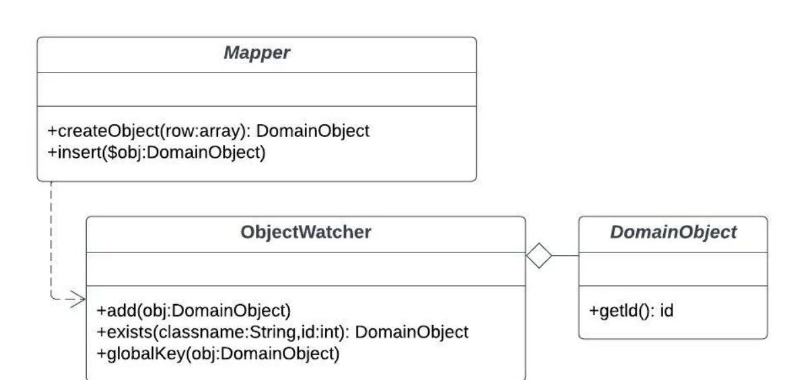

# Identity map

Identity Map —это просто объект, предназначенный для слежения за всеми остальными объектами в системе и помогающий исключить дублирование тех объектов, которые должны быть в единственном экземпляре

