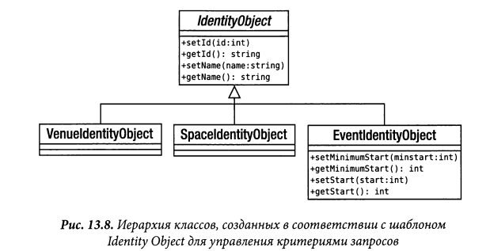

# Identity object

Представленная выше реализация преобразователя данных отличается
недостаточной гибкостью, когда речь идет о выявлении объектов предметной области. 
Найти отдельный объект совсем не трудно, как, впрочем, и все подходящие объекты
предметной области. Но если требуется
сделать нечто среднее между этими операциями, то придется добавить
специальный метод для подготовки запроса. В данном случае это метод
EventMapper::findBySpaceld(). Шаблон Identity Object (Объект идентичности),
который у Алура и других называется “Data Transfer Object” (Объект передачи данных),
инкапсулирует критерии запроса, развязывая тем самым систему от синтаксиса
базы данных.

Трудно знать заранее, что именно понадобится искать в базе данных
вам или другим программистам. Чем сложнее объект предметной области,
тем больше фильтров может потребоваться в запросе. Эту задачу можно
в какой-то степени решить, добавляя от случая к случаю дополнительные
методы в классы типа Mapper. Но это, конечно, не очень удобно и может
привести к дублированию кода, когда потребуется подготовить много схожих, но все
же различающихся запросов как в одном классе Mapper, так
и во всех преобразователях данных, применяемых в системе.

Шаблон Identity Object инкапсулирует условные составляющие запроса к базе данных
таким образом, чтобы их можно было сочетать в различных комбинациях во время
выполнения.

