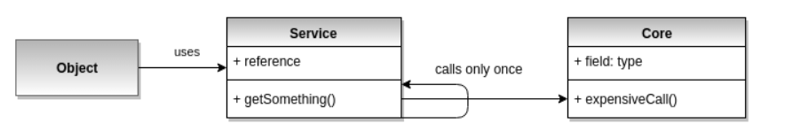

# Lazy load

Ленивая загрузка — это шаблон разработки программного обеспечения,
при котором инициализация объекта происходит только тогда, когда это действительно 
необходимо, а не раньше, чтобы сохранить простоту использования и повысить 
производительность.

Противоположностью ленивой загрузке является так называемая нетерпеливая загрузка,
при которой данные, ресурс и объект создаются во время инициализации.

Практический пример — чтение данных из базы данных, где каждый запрос требует
больших затрат с точки зрения производительности. Когда данные запрашиваются 
с помощью метода получения, они извлекаются в это время, а не раньше.