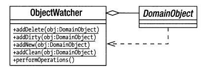

# Unit of work

Unit of Work - это паттерн определяющий логическую транзакцию т.е.
атомарную синхронизацию изменений в объектах, помещённых в объект UoW с
хранилищем (базой данных).

Если обратиться к исходному описанию этого паттерна у Мартина Фаулера - то
видно что объект, реализующий этот паттерн отвечает за накопление информации 
о том какие объекты входят в транзакцию и каковы их изменния относительно исходных 
значений в хранилище. Основная работа производится в методе commit() который 
отвечает за вычисление изменений в сохранённых в UoW объектах и синхронизацию 
этих изменений с хранилищем (базой данных).

Если говорить о PHP — то лучшей реализацией этих паттернов на PHP безусловно
является Doctrine ORM. В частности в разделе Working with Objects документации
Doctrine можно найти хорошее описание и множество примеров использования паттернов,
описанных выше.

