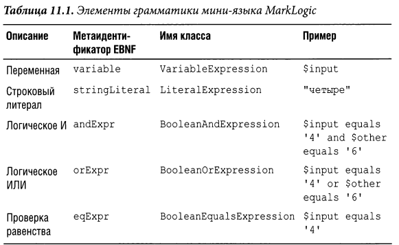
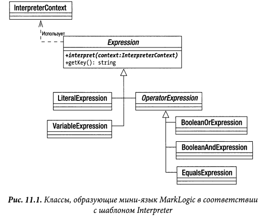
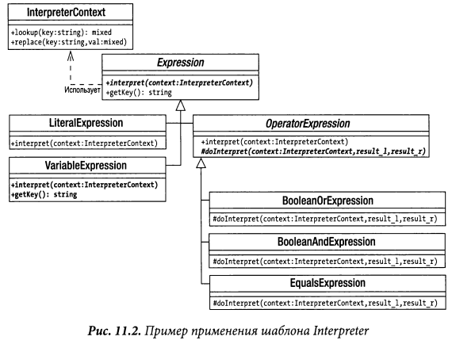

# Interpreter

Интерпретатор (англ. Interpreter) — поведенческий шаблон проектирования, 
решающий часто встречающуюся, но подверженную изменениям, задачу.
Также известен как Little (Small) Language

