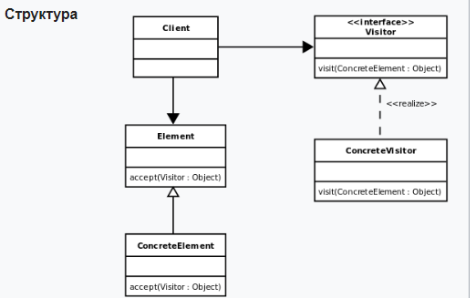
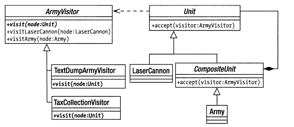

# Visitor

Посетитель (англ. visitor) — поведенческий шаблон проектирования, 
описывающий операцию, которая выполняется над объектами других классов. 
При изменении visitor нет необходимости изменять обслуживаемые классы.

Паттерн Посетитель (Visitor) позволяет определить операцию для объектов
других классов без изменения этих классов.

При использовании паттерна Посетитель определяются две иерархии классов:
одна для элементов, для которых надо определить новую операцию, и вторая 
иерархия для посетителей, описывающих данную операцию.

