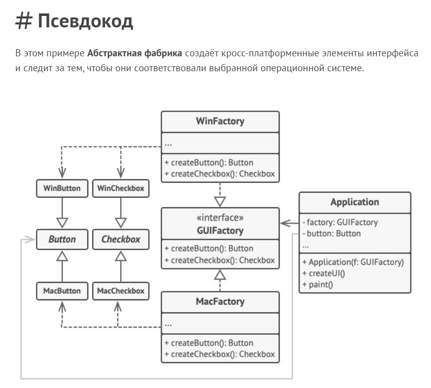
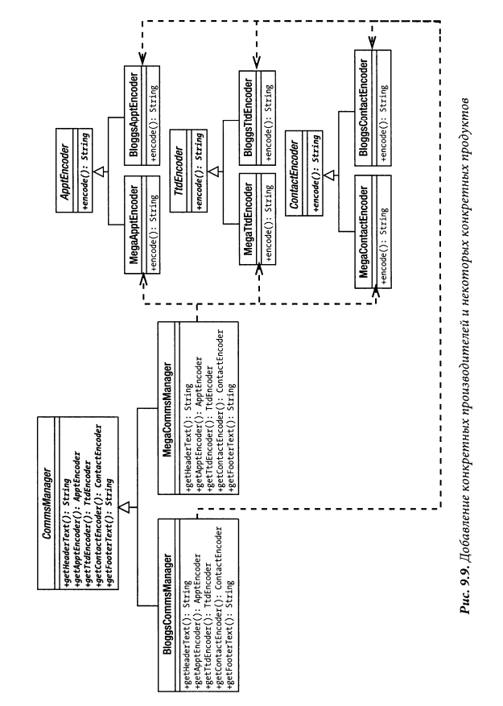

# Abstract Factory

Абстрактная фабрика - это порождающий паттерн проектирования, который позволяет создавать
семейства связанных объектов, не привязываясь к конкретнным классам создаваеммых
объектов.

Book
