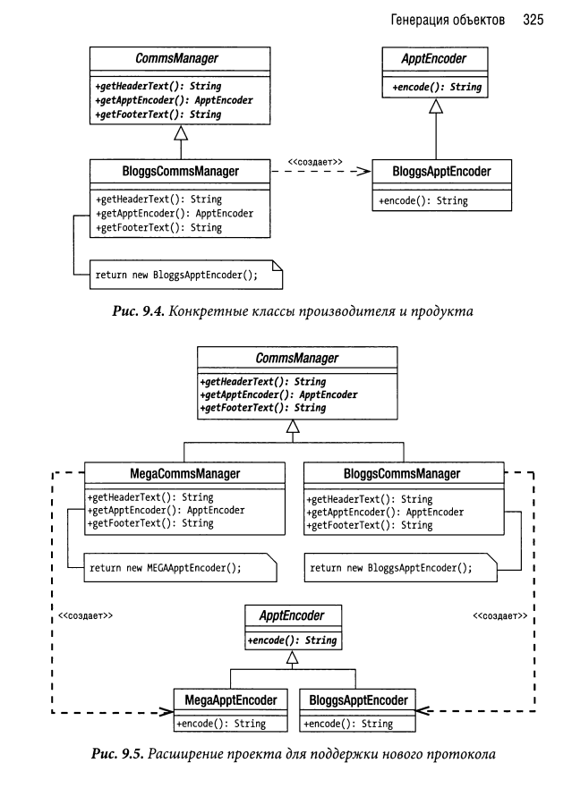

# Factory Method

В шаблоне Factory Method классы производителей отделены от продуктов, которые они должны формировать. Производитель — это класс
фабрики, в котором определен метод для генерации объекта отдельного
продукта. Если стандартная реализация этого метода не предусмотрена, то
создание экземпляров объектов поручается дочерним классам производителя. Как правило, в каждом подклассе производителя получается экземпляр параллельного дочернего класса продукта.

