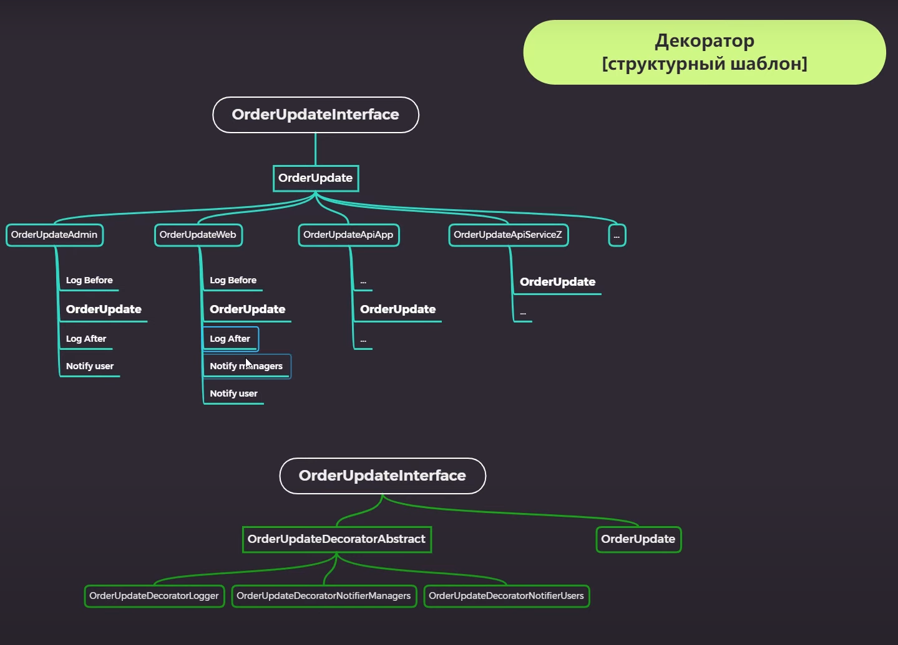

# Decorator

Декоратор - структурный шаблон проектирования, предназначенный для динамического
подключения дополнительного поведения к объекту. Шаблон Декоратор предоставляет гибкую
альтернативу практике создания подклассов с целью ресширения функциональности.

Объект, который предполагается использовать, выполняет основные функции.
Однако может потребоваться добавить к нему некоторую дополнительную функциональность,
которая будет выполняться до, после или даже вместо основной функциональности объекта.

Декоратор - это структурный паттерн проектирования, который позволяет динамически
добавлять объектам новую функциональность, оборачивая их в полезные "обёртки".

