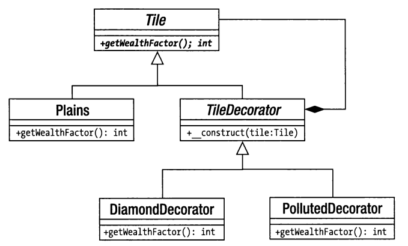

# Decorator

Каждый из этих классов расширяет класс TileDecorator.Это означает, 
что у них имеется ссылка на объект типа Tile.Когда вызывается метод
getWealthFactor() , каждый из этих классов сначала вызывает такой же
метод по ссылке на объект типа Tile, а затем выполняет собственную 
коррекцию значения. Используя композицию и делегирование подобным образом,
мы легко можем комбинировать объекты во время выполнения программы. Все
объекты, создаваемые по данному шаблону, расширяют класс Tile,
поэтому клиентскому коду совсем не обязательно знать, какой именно 
комбинацией объектов он оперирует. Можно быть уверенным, что метод
getWealthFactor() доступен для любого объекта типа Tile независимо
от того, декорирует ли он “за сценой” другой объект.

