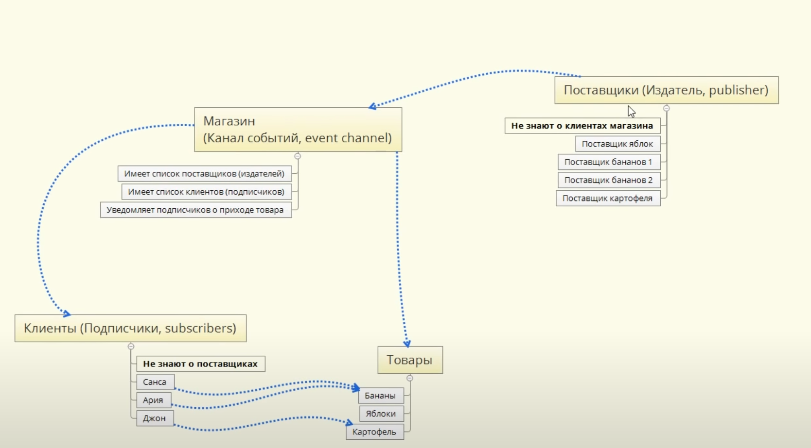

# Event channel

Канал событий (event channel) - фундаментальный шаблон проектирования, используется
для создания канала связи и коммуникации через него посредством событий.

Этот канал обеспечивает возможность разными издателям публиковать события и подписчикам,
подписываясь на них, получать уведомления.

