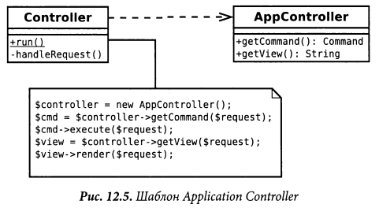
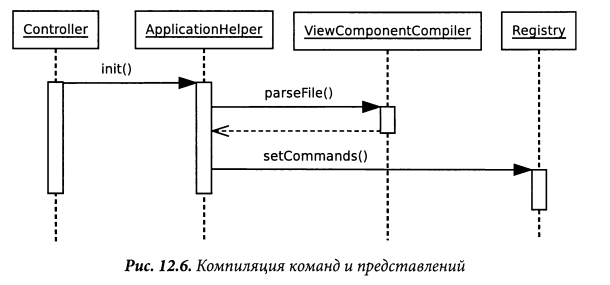

# Application controller

Единая точка управления отображением и выполнением приложения.

Некоторые приложения содержат в разных своих частях значительное количество кода,
управляющего отображением, и который может влиять на некоторые отображения в
некоторых условиях. Конечно, есть пошаговый тип взаимодействия, когда пользователь
последовательно проходит через страницы (экраны) в строго определённом порядке.
В остальных же случаях могут быть страницы, появляющиеся только в определённых 
условиях или выбор следующего отображения зависит от того, что ввёл пользователь
ранее.

В некотором роде, различные контроллеры в паттерне MVC могут делать этот выбор,
однако с ростом приложения это выльется в дублирование кода, так как несколько
контроллеров должны будут знать, что делать в той или иной ситуации.

Устранить это дублирование можно посредством помещения всей логики выполнения 
приложения в Контроллер приложения (Application Controller). 
Тогда контроллер входа (Input Controller) будет обращаться к контроллеру 
приложения (Application Controller) за необходимыми к выполнению на модели и за
необходимыми представлениями (view) в зависимости от контекста.

