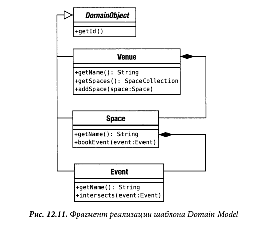

# Domain Model

Объектная модель домена, объединяющая данные и поведение.

К сожалению, бизнес-логика приложения может быть очень сложной. 
Правила и логика описывают множество случаев и модификаций поведения.
Для обработки всей этой сложной логики и проектируются объекты. 
Паттерн Domain Model (модель области определения) образует сеть взаимосвязанных
объектов, в которой каждый объект представляет собой отдельную значащую
сущность: может быть настолько большую, как корпорация или настолько малую, 
как строка из формы заказа.

