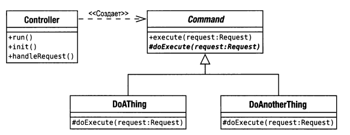
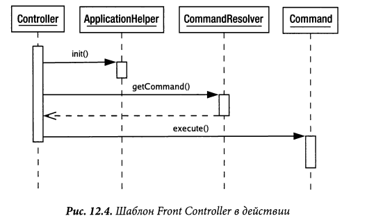

# Front controller

Единая точка входа (англ. Front controller) — обеспечивает унифицированный
интерфейс для интерфейсов в подсистеме. Front Controller определяет 
высокоуровневый интерфейс, упрощающий использование подсистемы.

Один контроллер обрабатывает все запросы к веб-сайту.

В сложных веб-сайтах есть много одинаковых действий, которые надо производить 
во время обработки запросов. Это, например, контроль безопасности, 
многоязычность и настройка интерфейса пользователя. 
Когда поведение входного контроллера разбросано между несколькими объектами, 
дублируется большое количество кода. Помимо прочего возникают сложности 
смены поведения в реальном времени.

