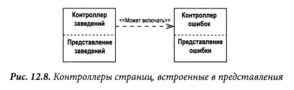
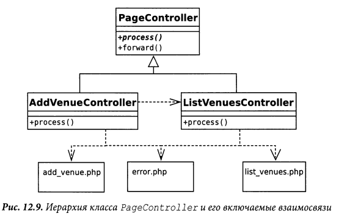

# Page controller

Объект, обрабатывающий запрос к отдельной странице или действию.

Большинство людей получают первый опыт в веб-программировании на
статичных HTML-страницах. Когда происходит запрос к статической HTML-странице, 
веб-серверу передаётся имя и путь к хранящемуся на нём HTML-документу. 
Главная идея здесь в том, что каждая страница на веб-сайте является отдельным
документом, хранящимся на сервере. В случае с динамическими страницами всё гораздо
сложнее, так как сложнее связь между введённым адресом и отображённой страницей. 
Тем не менее, подход, когда один путь соответствует одному файлу, который
обрабатывает запрос достаточно очевиден и прост для понимания.

В результате контроллер страницы (Page Controller) - паттерн, в котором один 
контроллер отвечает за отображение одной логической страницы. Это может быть 
как отдельная страница, хранящаяся на веб-сервере, так и отдельный объект, 
который отвечает за страницу.

