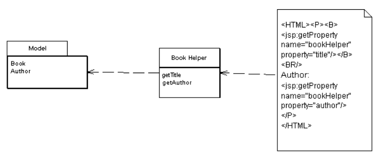

# Template View и View Helper

## Описание Template View

Заполняет HTML-шаблон информацией при помощи маркеров, указанных в шаблоне.

Создание приложений, генерирующих HTML, зачастую гораздо более сложно, 
чем кажется. Несмотря на то, что современные языки программирования стали
лучше справляться с обработкой текста, создание, и конкатенация строк всё ещё 
представляется проблемой. Если надо выводить немного информации - это не так страшно,
но если надо сгенерировать целую HTML-страницу - появляется много работы с текстом.

В случае со статическими HTML-страницами, которые не меняются от запроса к запросу,
можно использоваться удобный WYSIWYG-редактор. Даже те, кто любят обычные текстовые
редакторы согласятся, что набирать текст и тэги проще и удобнее, чем собирать 
их через конкатенации в языке программирования.

Конечно, возникает проблема в случае с динамическими страницами, которые, например,
берут данные из БД и наполняют ими HTML. Страницы выглядят по-разному каждый раз,
и использование обычного HTML-редактора не подходит.

Наилучший выход из положения - создание динамических страниц так же, как и статических,
но помечая их маркерами, которые могут быть заменены динамической информацией.

Пример: при обработке шаблона, области, помеченные специальными маркерами 
(на иллюстрации - тегами) заменяются результатами вызовов 
методов helper'a.

В том, как данные передаются уровню представления, есть повод для
беспокойства. Дело в том, что у представления на самом деле отсутствует фиксированный интерфейс, гарантирующий свое окружение. Каждое
представление можно рассматривать как вступающее в контакт со всей
системой в целом. Такое представление фактически сообщает приложению следующее: “Если я вызвано, значит, мне дано право получать доступ
к Этому,Тому или Другому_объекту”.И здесь все зависит от конкретного
приложения (разрешать такой доступ или не разрешать).
