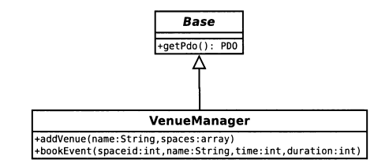

# Transaction script

Организует бизнес-логику в процедуры, которые управляют каждая своим запросом.

Большинство бизнес-приложений можно представить в виде набора транзакций. 
Какие-то из них выбирать данные, какие-то ‐ меняют. Каждое взаимодействие 
пользователя и системы содержит определённый набор действий. 
В некоторых случаях это может быть просто вывод данных из БД.
В других случаях эти действия могут содержать в себе множество вычислений и проверок.

Паттерн Transaction Script организует всю эту логику в одну процедуру, 
работая в БД напрямую или через тонкую обёртку. Каждая транзакция имеет 
свой Transaction Script, хотя общие подзадачи могут быть разбиты на процедуры.

